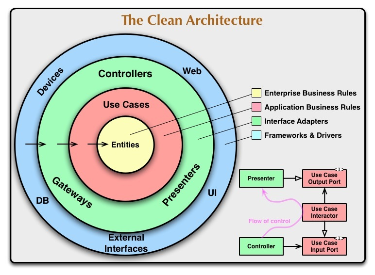

### Version (prerequisite)
1. Flutter channel: `stable`
2. Flutter version: 
3. FVM version: 
4. Xcode version: `14.0.1`
### How to upgrade flutterSDK to the latest version.
1. open terminal
2. Run the `flutter channel stable` command
3. Run the `flutter upgrade` command
-> Restart Android Studio or VSCode to update the latest FlutterSDK version
- [Reference](https://docs.flutter.dev/development/tools/sdk/upgrading)

# I. How to build
## 1. Generate string:N/A
### 1.1. Install Flutter
Install as per [Flutter installation website](https://flutter.io/docs/get-started/install)
Once completed, run `flutter doctor` to check if everything is working properly.
### 1.1. Install Demo GetX Flutter (Makefile).
When you run the `make help` command, the output is as follows.

    make help
    analyze                          Analyze the code
    clean                            Cleans the environment
    colors                           show all the colors
    format                           Formats the code
    gen                              Trigger one time code generation
    lint                             Lints the code
    run_dev_mock                     Runs the mobile application in dev
    run_stg                          Runs the mobile application in dev
    run_unit_test                    Runs unit tests
    setup                            Setup project
    upgrade                          Upgrades dependencies
    watch                            Watch files and trigger code generation on change
reference:
* http://clarkgrubb.com/makefile-style-guide
* http://marmelab.com/blog/2016/02/29/auto-documented-makefile.html

## New project installation procedure
1. Follow the prerequisites and install.
2. Run the `fvm use 3.7.12` command to apply flutter version by FVM for the project.
if you don't use FVM. Go to `Makefile`, search all and replace `@fvm flutter` by `@flutter`
3. Run the `make setup` command to install the project.
4. Run the `make run_dev_mock` command to run the application on simulator.

# II. System Architecture (Clean Architecture)
This project is built based on Clean Architecture and includes the following five layers.
- Data
- Domain
- Presentation
- Utils
- Config
## 2. System architecture details
### A. Definition of Clean Architecture

### 2.1.Data
- The Data module is the outermost layer and is responsible for acquiring data.
### Data contents
### Repositories
- Data layer repository must be implemented from domain layer repository.
- Retrieve data from a database or other methods.
- Responsible for API calls and high-level data.
### Models
- Extending the entity by adding additional members that may be platform dependent.
### 2.2.Domain
- Domain module defines the business logic of the application. This is a development platform independent module. That is, it is written in a programming language and does not include any platform elements. The reason is that Domain focuses only on the business logic of an application and is not concerned with implementation details. This also allows for easy migration between platforms in case of problems.
#### 2.2.1.Entities
- Enterprise-wide business rules.
- Consists of classes containing methods.
- Application business objects.
- Used throughout the application.
- Least likely to change when something in the application changes.
#### 2.2.2.Repositories
- Abstract class that defines the expected functionality of the outer layer.
- Passed from the outer layer to the use case.
- Domain represents the innermost layer. Therefore, this is the most abstract layer in the architecture.
### 2.3.Presentation
- Represents the UI of the page.
- State management: `getX`
### 2.4. Utils
- The Utils folder contains helpers, services, UI utils, and validation mixins used throughout the application.
### 2.5.Config
- Configure and define dynamic variables for each flavor.
### 2.6. Library Requirements
# III.Reference
- [App Architecture Guide](https://blog.cleancoder.com/uncle-bob/2012/08/13/the-clean-architecture.html)
# IV.API
* [Documentation for making call API requests]
* [Style Guide]

# V.Application Review
### 5.1. Iphone Simulator

### 5.2. Android Emulator

